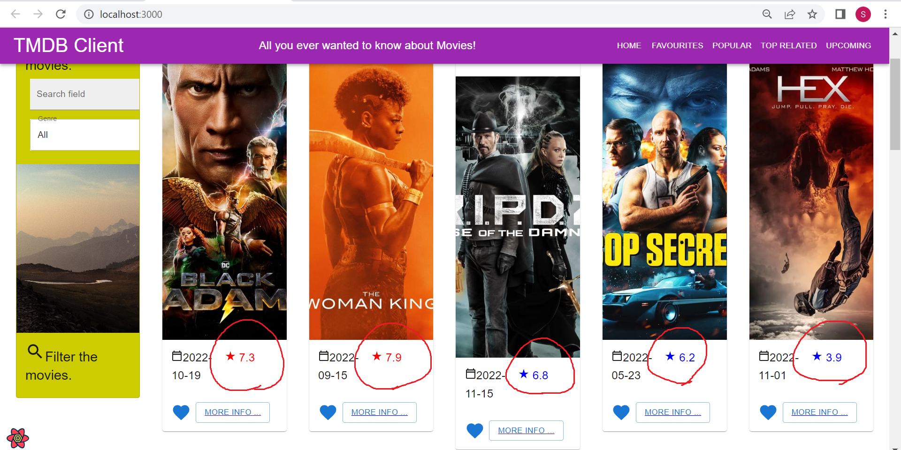
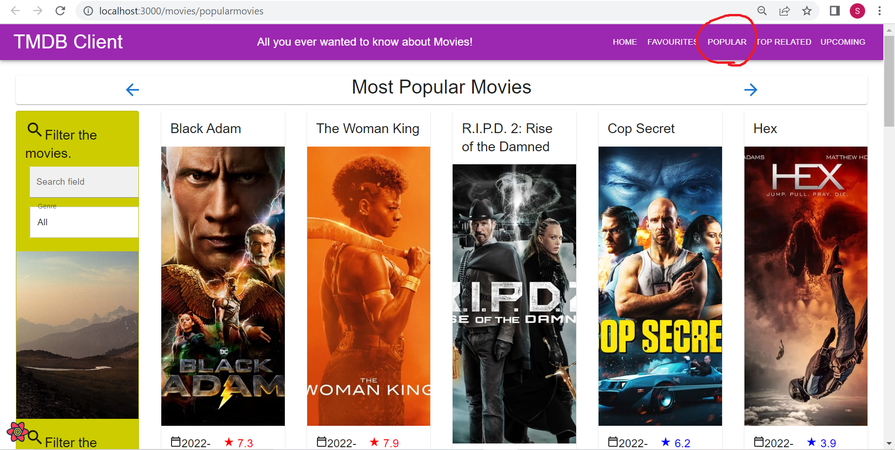

# Web App Dev 2 - Assignment 1 - ReactJS app.

Name: Shizuku Kokumai

## Overview.
I added "POPULAR", "TOP RELATED", and "UPCOMING" in the site header. In POPULAR, it shows the a list of the current popular movies on TMDB, and this list updates daily. In TOP RELATED, it shows a list of the top related movies on TMDB. In "UP COMING", it shows a list of upcoming movies in theatres. And I changed the valuatoin color based on how well they're rated. If it is less than 7, the color is blue. If it is greater than 7, the color is red.

### New Pages.

+ List of popular movies.
+ List of top related movies
+ List of upcoming movies
+ Modified the voluation color

### New Features.

[ Provide a bullet-point list of the __new features__ you added to the Movies Fan app.] 

+ The color of the number of ratings depends on the height of the rating

## Setup requirements.

[ Outline any non-standard setup steps necessary to run your app locally after cloning the repo.]

Nothing.

## TMDB endpoints.

[ List the __additional__ TMDB endpoints used, giving the description and pathname for each one.] 

e.g.

+ /movies/popularmovies - the list of popular muvies
+ /movies/toprelated - the list of top related movies
+ /movies/upcoming - the list of upcoming movies

## App Design.

### Component catalogue.

>Shows home page. As circled in red, the letters are red when the rating is 7 or higher, and blue when the rating is less than 7. 

### UI Design.

>Shows Most Popular Movies page. Clicking the 'POPULAR' in the header, this page appears. 

>Shows Top Relatad Movies page. Clicking the 'TOP RELATED' in the header, this page appears. 

>Shows Upcoming Movies page. Clicking the 'UPCOMING' in the header, this page appears. 

### Routing.

Nothing.

## Independent learning (If relevant).

Nothing.